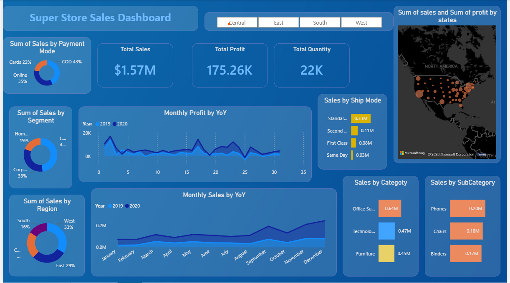

# Superstore Sales Performance Dashboard (Power BI)

## Objective
To analyze retail sales performance and generate actionable business insights using Power BI.

## Key KPIs
- Total Sales
- Total Profit
- Total Quantity Sold
- Profit Margin

## Analysis Performed
- Monthly sales and profit trend analysis (YoY)
- Regional and state-wise sales performance
- Customer segment and payment mode analysis
- Product category and sub-category performance
- Shipping mode analysis

## Tools & Technologies
- Power BI
- DAX
- Microsoft Excel

## Dataset
Sample Superstore Dataset (publicly available)

## Notes
The interactive dashboard is available in the PBIX file.
